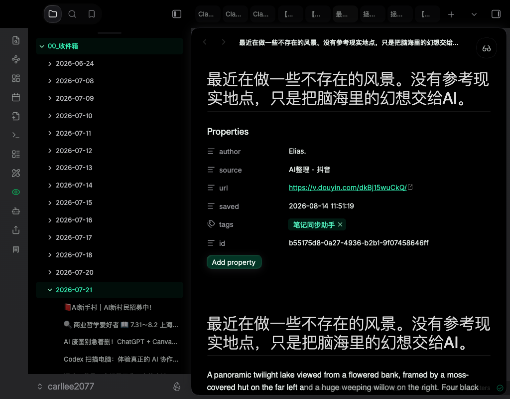

# 🟢 绿透 green-glass

纯黑底 + 流体玻璃 + 克制翠绿的个人工作台视觉体系。一条命令，给你的 Obsidian 换上，或生成一个同款的个人工作台 Web 应用。

```bash
npx skills add LearnPrompt/green-glass -g
```

装完对你的 AI 编码工具说「给我的 Obsidian 装绿透」或「生成一个绿透工作台」就行。



## 不装 skill 也能用

**只想要 Obsidian 皮肤：**

1. 下载 [`assets/green-glass.css`](assets/green-glass.css)，放进你 vault 的 `.obsidian/snippets/` 目录
2. Obsidian 设置 → 外观 → CSS 代码片段，打开 `green-glass`
3. 切到暗色模式

卸载 = 关掉开关或删掉这个文件，不碰你的主题和数据。

**只想要现成的工作台页面：**

下载 [`assets/workbench.html`](assets/workbench.html)，浏览器直接打开。文件头部有一个 `window.WORKBENCH` 配置块，改几行文字就是你的工作台；改 `accentH` 一个数字整站换色。


**只想要工作台生成提示语：**

打开 [`references/workbench-prompt.md`](references/workbench-prompt.md)，填几个占位符（工作区名、内容平台），整段复制给任何 AI 编码工具。

## 这套体系是什么

按一条真实参考界面逐项取的值，不是拍脑袋的配色：

- 底是纯黑 `#000000`，面板只比它亮一点点，全靠 1px 白色 6% 描边分层
- 主绿 `#0ac98c` 只有三种用法：信号点、深绿实底按钮、绿字徽章——绝不大面积铺绿
- 唯一的彩色面是流体玻璃统计卡：三团色球压暗底、重模糊、色相向琥珀连续偏移
- 大数字一律等宽 400 字重，靠字号不靠加粗

完整 token 表（底色阶 / 字阶 / 圆角间距 / 流体卡 CSS 配方）在 [`references/design-tokens.md`](references/design-tokens.md)，做别的东西也能直接抄。

## 仓库结构

```
green-glass/
├── SKILL.md                      # skill 入口（三条工作流路由）
├── assets/green-glass.css        # Obsidian snippet 本体
├── assets/workbench.html         # 单文件工作台页面（改配置块即用）
├── references/design-tokens.md   # 完整设计 token 表
├── references/workbench-prompt.md# 工作台生成提示语模板
└── screenshots/                  # 效果图
```

---

## English

**green-glass** — a personal-workbench visual system: pure-black background, fluid-glass cards, restrained emerald. One command to skin your Obsidian with it, or to generate a matching personal workbench web app.

```bash
npx skills add LearnPrompt/green-glass -g
```

Then tell your AI coding tool "apply green-glass to my Obsidian" or "generate a green-glass workbench".

**Without the skill:**

- *Obsidian skin only*: drop [`assets/green-glass.css`](assets/green-glass.css) into your vault's `.obsidian/snippets/`, enable it under Settings → Appearance → CSS snippets, switch to dark mode. Uninstall = delete one file.
- *Ready-made workbench*: download [`assets/workbench.html`](assets/workbench.html) and open it in a browser — edit the `window.WORKBENCH` config block at the top to make it yours; change `accentH` to recolor the whole page.
- *Prompt only*: open [`references/workbench-prompt.md`](references/workbench-prompt.md), fill in the placeholders, paste the whole thing into any AI coding tool.

**The system in one breath**: pure black `#000000` base, panels separated by 1px white-6% borders instead of shadows; the accent green `#0ac98c` has exactly three permitted uses (signal dot, deep-green solid button, green-text badge); the only colored surface is a row of fluid-glass stat cards whose hues drift toward amber. Full token table in [`references/design-tokens.md`](references/design-tokens.md).

MIT
