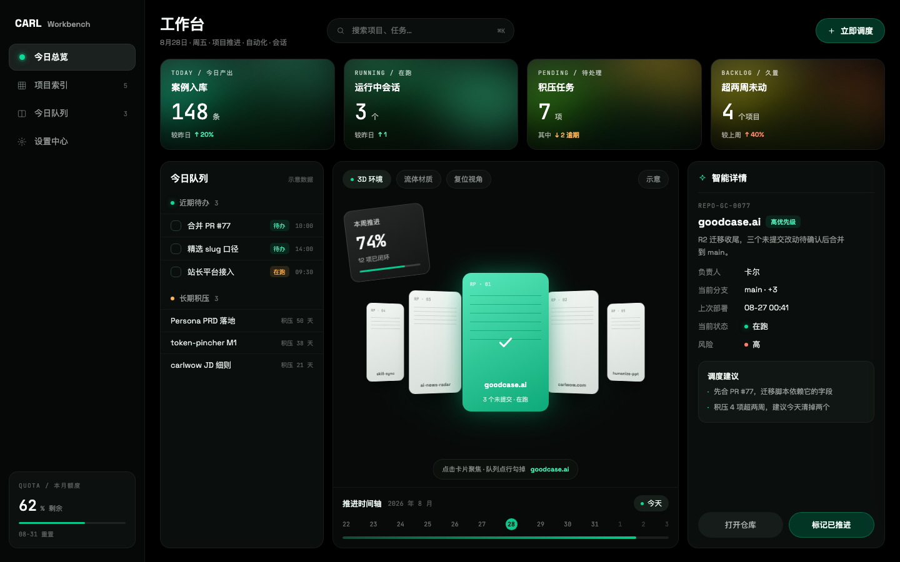
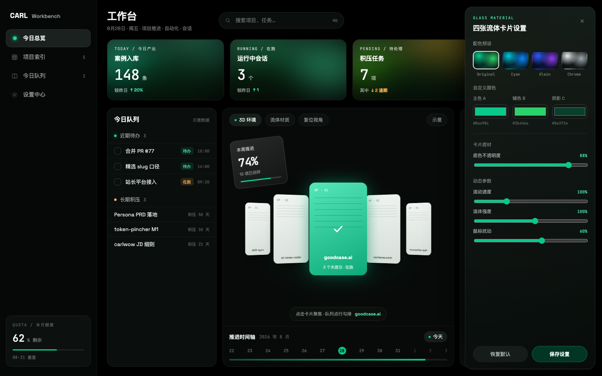

<div align="center">

# 🟢 绿透 green-glass

**纯黑底 · 流体玻璃 · 克制翠绿，一个能接上你真实数据的个人工作台**

中文 · [English](#english)

</div>



## 安装

```bash
npx skills add LearnPrompt/green-glass -g
```

## 装好后，对 AI 说人话

装完打开 Claude Code（或任何支持 skill 的编码工具），直接说：

> **「给我装一个绿透工作台，项目在 ~/projects，Obsidian vault 在 ~/Documents/notes」**

它会问清目录、扫你的 git 仓库和 Obsidian 待办、生成一个双击就能打开的工作台页面。之后常用的三句：

> **「刷新我的工作台」** —— 重新采集，页面一刷就是新数据
>
> **「给我的 Obsidian 换上绿透皮肤」** —— vault 界面也换成同款视觉
>
> **「用绿透风格给我生成一个工作台 App」** —— 用内置提示语从零生成 React 版

## 工作台里有什么

- **四张流体玻璃统计卡**：今日提交 / 在跑仓库 / 待办 / 久置项目，三团色球压暗底缓慢漂移，鼠标划过会跟着扰动
- **3D 项目卡环**：最近活跃的仓库排成透视卡环，点击聚焦，聚焦卡发光
- **今日队列（混合模式）**：自动扫 Obsidian 里的 `- [ ]` 勾选框，加上 AI 从会话里策展的待办，条条带来源文件名，点行勾掉
- **项目索引**：全部仓库的分支 / 未提交改动 / 最近提交，搜索框实时过滤
- **订阅区块**：采集命令加 `--rss <源地址>`，任何 RSS/Atom 源直接上墙；`customSections` 协议开放，任何脚本都能投喂自定义区块
- **安静模式**：一键关掉全部动效和自动巡航，页面完全静止；积压任务可归档（不动源文件）
- **调色面板**：Original / Cyan / Klein / Chrome 四个预设，主色 A · 辅色 B · 阴影 C 三色自定义，底色不透明度、流动速度、流体强度、鼠标扰动全部可调，改动记在浏览器里



## 不装 skill 也能用

**只要工作台页面**：下载 [`assets/workbench.html`](assets/workbench.html)，浏览器直接打开（默认示意数据）。想接真数据，跑一条命令，把生成的 `workbench-data.js` 放它旁边：

```bash
python3 scripts/collect.py --projects ~/projects --vault ~/你的vault --out ~/Downloads
```

只读不写：扫 git 仓库的分支、未提交、今日提交，和 Obsidian 全库的 `- [ ]` 待办（剪藏、归档目录自动排除）。

**只要 Obsidian 皮肤**：下载 [`assets/green-glass.css`](assets/green-glass.css) 放进 vault 的 `.obsidian/snippets/`，在 设置 → 外观 → CSS 代码片段 里打开，切暗色模式。卸载 = 删这一个文件。

**只要生成提示语**：打开 [`references/workbench-prompt.md`](references/workbench-prompt.md)，填几个占位符，整段丢给任何 AI 编码工具。

## 视觉体系

按一条真实参考界面逐项取的值，不是拍脑袋的配色：

- 底是纯黑 `#000000`，面板只比它亮一点点，全靠 1px 白色 6% 描边分层
- 主绿 `#0ac98c` 只有三种用法：信号点、深绿实底按钮、绿字徽章，绝不大面积铺绿
- 唯一的彩色面是流体玻璃卡：色相沿四张卡向琥珀连续偏移
- 大数字一律等宽字体 400 字重，靠字号不靠加粗

完整 token 表（底色阶 / 字阶 / 圆角间距 / 流体卡 CSS 配方）在 [`references/design-tokens.md`](references/design-tokens.md)，做别的东西也能直接抄。

## 仓库结构

```
green-glass/
├── SKILL.md                       # skill 入口（三条工作流路由）
├── assets/workbench.html          # 单文件工作台（四视图 + 调色面板）
├── assets/green-glass.css         # Obsidian 皮肤 snippet
├── scripts/collect.py             # 本地采集：git 仓库 + vault 待办 → workbench-data.js
├── references/design-tokens.md    # 完整设计 token 表
├── references/workbench-prompt.md # 工作台生成提示语模板
└── screenshots/                   # 效果图
```

---

<a id="english"></a>

## English

**green-glass** — a personal workbench in one HTML file: pure-black base, fluid-glass cards, restrained emerald, wired to your real local data.

### Install

```bash
npx skills add LearnPrompt/green-glass -g
```

### Then just talk to your AI

Open Claude Code (or any skill-aware coding tool) and say:

> **"Set up a green-glass workbench for me — my repos are in ~/projects, my Obsidian vault is at ~/Documents/notes"**

It asks for your directories, scans your git repos and Obsidian tasks, and produces a workbench page you open with a double click. After that:

> **"Refresh my workbench"** — re-scan, reload the page, fresh data
>
> **"Apply the green-glass skin to my Obsidian"** — your vault gets the same look
>
> **"Generate a workbench app in the green-glass style"** — builds a React version from the bundled prompt

### What's inside the workbench

- **Four fluid-glass stat cards** — commits today / active repos / tasks / stale projects, with slowly drifting color blobs that react to your mouse
- **A 3D project ring** — your most recently active repos in a perspective carousel; click to focus
- **Today's queue (hybrid mode)** — auto-collected `- [ ]` checkboxes from your Obsidian vault plus AI-curated tasks from your sessions, each labeled with its source file; click a row to check it off
- **Project index** — every repo's branch, uncommitted changes, and last commit, with live search
- **Feed sections** — pass `--rss <urls>` to the collector to put any RSS/Atom feed on the wall; the open `customSections` protocol lets any script inject its own panels
- **Calm mode** — one switch kills all motion and auto-cruise; backlog items can be archived without touching source files
- **A material panel** — Original / Cyan / Klein / Chrome presets, custom colors A·B·C, base opacity, flow speed, fluid strength, and mouse turbulence, all persisted in your browser

### Use it without the skill

**Workbench page only**: download [`assets/workbench.html`](assets/workbench.html) and open it in a browser (ships with sample data). To feed it real data, run one command and drop the generated `workbench-data.js` next to it:

```bash
python3 scripts/collect.py --projects ~/projects --vault ~/your-vault --out ~/Downloads
```

Read-only: it scans git branches, uncommitted changes, and today's commits, plus unchecked `- [ ]` tasks across your vault (clippings and archive folders excluded).

**Obsidian skin only**: drop [`assets/green-glass.css`](assets/green-glass.css) into your vault's `.obsidian/snippets/`, enable it under Settings → Appearance → CSS snippets, and switch to dark mode. Uninstall = delete one file.

**Prompt only**: open [`references/workbench-prompt.md`](references/workbench-prompt.md), fill in the placeholders, and paste the whole thing into any AI coding tool.

### The design system

Every value was sampled from a real reference interface, not invented:

- Pure black `#000000` base; panels sit barely above it, separated by 1px white-6% borders instead of shadows
- The accent green `#0ac98c` has exactly three permitted uses: signal dots, deep-green solid buttons, green-text badges — never large green fills
- The only colored surface is the row of fluid-glass cards, whose hues drift toward amber card by card
- Big numbers are always monospaced at weight 400 — size carries the hierarchy, not boldness

Full token table (background ramp, type scale, radii, spacing, and the fluid-card CSS recipe) in [`references/design-tokens.md`](references/design-tokens.md).

### Repository layout

```
green-glass/
├── SKILL.md                       # skill entry (three workflows)
├── assets/workbench.html          # the single-file workbench (four views + material panel)
├── assets/green-glass.css         # Obsidian skin snippet
├── scripts/collect.py             # local collector: git repos + vault tasks → workbench-data.js
├── references/design-tokens.md    # the full design token table
├── references/workbench-prompt.md # the fill-in generation prompt
└── screenshots/
```

MIT
